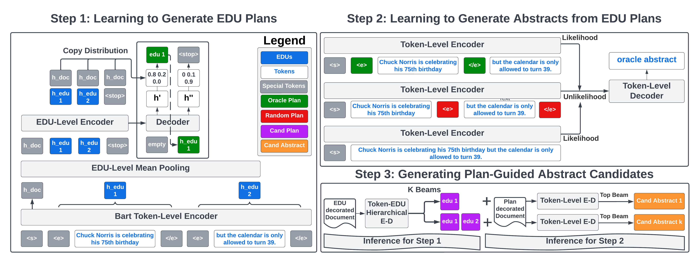

# Generating EDU Extracts for Plan-Guided Summary Re-Ranking

This is the PyTorch implementation of the ACL 2023 Paper: [Generating EDU Extracts for Plan-Guided Summary Re-Ranking](https://arxiv.org/abs/2305.17779).

Please feel free to raise an Issue or directly email `griffin.adams@columbia.edu` with any questions.



# Setup

```
pip install -e .
cd transformers && pip install -e . && cd ../
export DATA_DIR={path for saving data/models/results}
export ROUGE_HOME="{your-desired-path}/ROUGE-1.5.5/"
bash setup_rouge.sh
python -m spacy download en_core_web_sm
export WANDB_API_KEY={a weights & biases API key}
```

If you want to use BRIO re-ranker, please feel README under `./BRIO`. The directory is [borrowed](https://github.com/yixinL7/BRIO) from the original [BRIO paper](https://arxiv.org/abs/2203.16804).

# Preprocess

```angular2html
python preprocess/split_into_sentences.py
[Run NeuralEDUSeg EDU segmenter]
python preprocess/add_edu.py
python preprocess/align_edu.py
```

The `NeuralEDUSeg` model comes from [codebase](https://github.com/PKU-TANGENT/NeuralEDUSeg) is described in the EMNLP 2018 paper ([Toward Fast and Accurate Neural Discourse Segmentation
](https://aclanthology.org/D18-1116/)). Instructions will be posted shortly for how to run the parser on sentence level.

# Training

## EDU Extract Generator

```angular2html
python model/main.py --dataset cnn_dailymail --summary_style extract --experiment {my-extract-experiment} --wandb_project {yours} --wandb_entity {yours}
```

## Extract-Guided Abstractor

```angular2html
python model/main.py --summary_style abstract -extract_indicators --dataset cnn_dailymail --mle_weight 1.0 --like_coef 1.0 --unlike_coef 1.0 --experiment {my-abstract-experiment} --wandb_project {yours} --wandb_entity {yours}
```

See [paper](https://arxiv.org/abs/2305.17779) for guidance on setting Hyper-Parameters (`like_coef`, `unlike_coef`, and `mle_weight`). Setting to all `1` will give you reliable performance, and results are not overly sensitive to changes in the coefficients. Generally speaking, `mle_weight > like_coef, unlike_coef` leads to less diversity and less plan adherence.

We select the model (BART or PEGASUS) based on the dataset (BART for NYT and CNN/DailyMail) and PEGASUS for Xsum. When running PEGASUS on Xsum, we recommend changing default hyper-parameters by adding the following: `--lr 1e-4 --target_batch_size 64`.

# Generating Plan-Guided Abstracts

```angular2html
bash model/ea_pipeline.sh {device} {validation,test} {my-extract-experiment} {my-abstract_experiment} {max_examples}
```

EA stands for extract-abstract and performs the two-step generation described in the paper. Manually change `N_CAND=16` in `ea_pipeline.sh` to generate a different number of candidates.

## Re-Rank with BRIO

First we need to convert the plan-guided abstracts to the format expected by BRIO.

```angular2html
bash model/to_brio.sh {my-extract-experiment} {.csv file} {any suffix name}
```

`.csv file` will be the name of the csv file containing `from_beam_16_extract` file under `$DATA_DIR/results/{my-extract-experiment}/{.csv file}`. It will look something like `test_from_beam_16_extract.csv` depending on the split.

The end of the script will provide the specific command in `./BRIO` to run to obtain the final re-ranking results.

# Guiding with GPT

## Setup

Create a file `edu_gpt/oa_secrets.py` that which should look like

```angular2html
OA_KEY = 'sk-xx'
OA_ORGANIZATION = 'org-xx'
```

## Running

```
python edu_gpt/pga_prompts.py --extract_fn {.csv file}
python edu_gpt/run.py --extract_experiment {my-extract-experiment} --mode pga --candidates 16 --temperature 0.3
python edu_gpt/convert_to_brio.py --extract_experiment {my-extract-experiment} --mode pga
```

`{.csv}` file should be the absolute path to a file with extractive candidates: `$DATA_DIR/results/{my-extract-experiment}/test_beam_16_outputs.csv`.

Please email `griffin.adams@columbia.edu` for full test set 16 candidate outputs for `CNN/DM` and `Xsum` if you want to skip [EDU Generation](#EDU-Extract-Generator).

## Using Outputs for RLHF/Calibration

On a sample of 1,000 test set examples, we have uploaded PGA GPT-3.5-Turbo outputs, as well as outputs for sampling-methods (nucleus, temperature), as a [HuggingFace Dataset](https://huggingface.co/datasets/griffin/ChemSum).

Please feel free to download and use for any downstream use-case which requires high-quality diverse candidates.

```angular2html
from datasets import load_dataset
dataset = load_dataset('griffin/ChemSum')
```

# Citation

If you use this in your research, please cite

```
@article{adams2023generating,
  title={Generating EDU Extracts for Plan-Guided Summary Re-Ranking},
  author={Adams, Griffin and Fabbri, Alexander R and Ladhak, Faisal and McKeown, Kathleen and Elhadad, No{\'e}mie},
  journal={arXiv preprint arXiv:2305.17779},
  year={2023}
}
@inproceedings{wang-etal-2018-toward,
    title = "Toward Fast and Accurate Neural Discourse Segmentation",
    author = "Wang, Yizhong  and
      Li, Sujian  and
      Yang, Jingfeng",
    booktitle = "Proceedings of the 2018 Conference on Empirical Methods in Natural Language Processing",
    month = oct # "-" # nov,
    year = "2018",
    address = "Brussels, Belgium",
    publisher = "Association for Computational Linguistics",
    url = "https://aclanthology.org/D18-1116",
    doi = "10.18653/v1/D18-1116",
    pages = "962--967",
    abstract = "Discourse segmentation, which segments texts into Elementary Discourse Units, is a fundamental step in discourse analysis. Previous discourse segmenters rely on complicated hand-crafted features and are not practical in actual use. In this paper, we propose an end-to-end neural segmenter based on BiLSTM-CRF framework. To improve its accuracy, we address the problem of data insufficiency by transferring a word representation model that is trained on a large corpus. We also propose a restricted self-attention mechanism in order to capture useful information within a neighborhood. Experiments on the RST-DT corpus show that our model is significantly faster than previous methods, while achieving new state-of-the-art performance.",
}
@inproceedings{liu-etal-2022-brio,
    title = "{BRIO}: Bringing Order to Abstractive Summarization",
    author = "Liu, Yixin  and
      Liu, Pengfei  and
      Radev, Dragomir  and
      Neubig, Graham",
    booktitle = "Proceedings of the 60th Annual Meeting of the Association for Computational Linguistics (Volume 1: Long Papers)",
    month = may,
    year = "2022",
    address = "Dublin, Ireland",
    publisher = "Association for Computational Linguistics",
    url = "https://aclanthology.org/2022.acl-long.207",
    doi = "10.18653/v1/2022.acl-long.207",
    pages = "2890--2903",
    abstract = "Abstractive summarization models are commonly trained using maximum likelihood estimation, which assumes a deterministic (one-point) target distribution in which an ideal model will assign all the probability mass to the reference summary. This assumption may lead to performance degradation during inference, where the model needs to compare several system-generated (candidate) summaries that have deviated from the reference summary. To address this problem, we propose a novel training paradigm which assumes a non-deterministic distribution so that different candidate summaries are assigned probability mass according to their quality. Our method achieves a new state-of-the-art result on the CNN/DailyMail (47.78 ROUGE-1) and XSum (49.07 ROUGE-1) datasets. Further analysis also shows that our model can estimate probabilities of candidate summaries that are more correlated with their level of quality.",
}
```